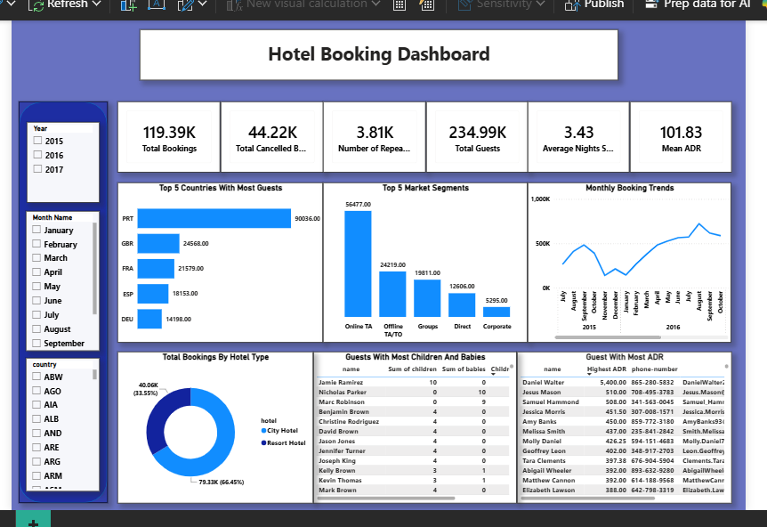

# Hotel Booking Demand Analysis

## Project Overview

This project analyzes hotel booking data from Slyva Crescent Hotel and Resort Hotel between July 2015 and August 2017. Using Power BI, the analysis explores guest demographics, booking behavior, hotel performance, and cancellation trends to uncover insights that support data-driven decision-making.

The dashboard answers key business questions regarding guest origin, average daily rates (ADR), length of stay, booking cancellations, and customer profiles through interactive visualizations.

## Objectives

- Identify the top five countries with the highest number of hotel bookings.
- Determine the guest with the highest Average Daily Rate (ADR).
- Calculate the mean ADR.
- Calculate the average number of nights guests stayed.
- Identify the booking with the highest number of children and babies.
- Answer additional business questions to generate actionable insights.
- Build an interactive Power BI dashboard for hotel management.

## Tools & Technologies

- Power BI
- Power Query
- DAX

- ## Dashboard Features

- KPI Cards displaying:
  - Total Bookings
  - Total Cancelled Bookings
  - Number of Repeat Guests
  - Total Guests
  - Average Nights Stayed
  - Mean Average Daily Rate (ADR)
- Top 5 Countries with the Most Guests
- Top 5 Market Segments
- Monthly Booking Trends
- Hotel Type Distribution (City Hotel vs Resort Hotel)
- Guests with the Most Children and Babies
- Guests with the Highest ADR
- Interactive slicers for Year, Month, and Country

## Key Skills Demonstrated

- Data Cleaning
- Data Transformation
- Data Modeling
- DAX
- Data Visualization
- Dashboard Design
- Business Intelligence
- Data Storytelling

## Repository Contents

- Hotel Booking Dashboard.pbix
- CLEANED_DATA.csv
- DASHBOARD.png
- EXECUTIVE_SUMMARY.pdf
- BUSINESS_QUESTIONS.pdf

## Dashboard Preview

