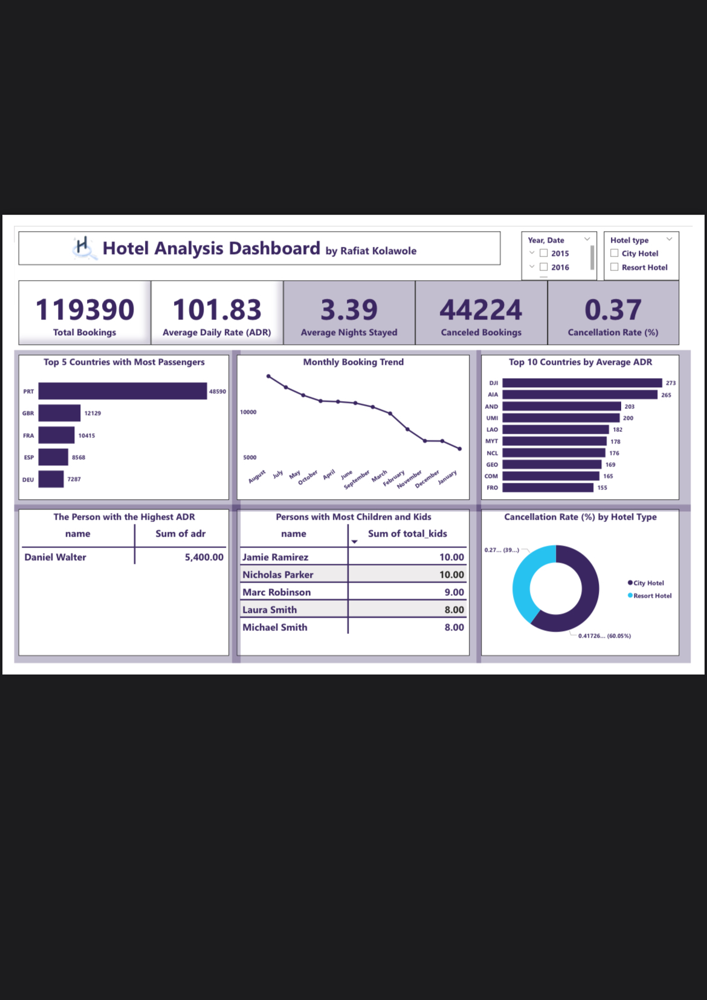

# Hotel Booking Demand Analysis

## Project Overview
This project analyzes hotel booking data over a three-year period to uncover patterns in customer behavior, seasonal demand, pricing stability, and booking cancellations.

The analysis provides insights that can support better pricing, marketing, and operational planning decisions for hotels.

## Tools Used
- Power BI
- Data Cleaning & Preparation
- Data Visualization
- Trend Analysis

## Objectives
- Identify high and low demand periods
- Analyze guest origin and length of stay
- Examine booking cancellations and contributing factors
- Evaluate pricing trends using Average Daily Rate (ADR)

## Key Insights
- Booking activity remained strong across the three-year period
- Clear peak and low seasons were observed
- The majority of guests originated from a small number of major countries
- Average Daily Rate (ADR) remained relatively stable over time
- Cancellations were present but remained at manageable levels

## Business Impact
These insights can help hotels optimize pricing strategies, target marketing efforts more effectively, and plan resources efficiently—especially during slower demand periods.

## Conclusion
This project strengthened my Power BI skills, particularly in data cleaning, visualization, and trend interpretation, while demonstrating how data-driven insights can support strategic decision-making in the hospitality industry.

## Dashboard Preview

